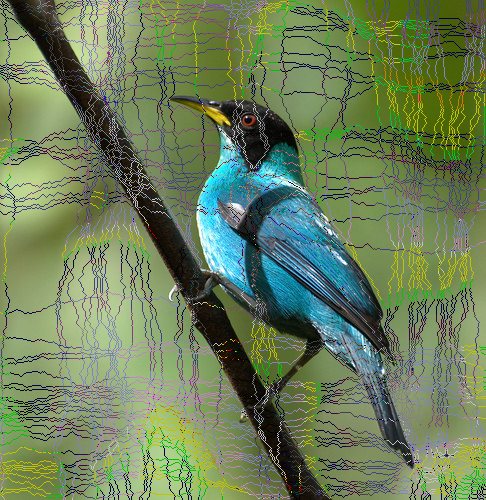
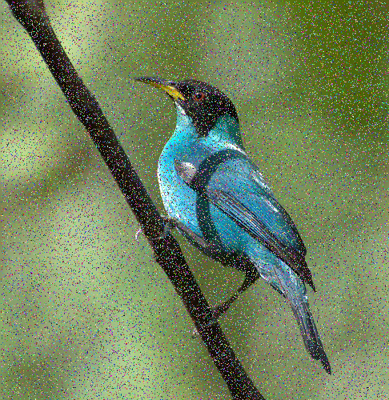

<h1 align="center">
  <a href="https://github.com/jpope8/seam-doppelganger">
    <!-- Please provide path to your logo here -->
    
  </a>
</h1>

<div align="center">
  Seam Doppelganger
  <br />
  <a href="#basic-usage"><strong>Usage »</strong></a>
  <br />
  <!--
  <br />
  <a href="https://github.com/jpope8/seam-doppelganger/issues/new?assignees=&labels=bug&template=01_BUG_REPORT.md&title=bug%3A+">Report a Bug</a>
  ·
  <a href="https://github.com/jpope8/seam-doppelganger/issues/new?assignees=&labels=enhancement&template=02_FEATURE_REQUEST.md&title=feat%3A+">Request a Feature</a>
  .
  <a href="https://github.com/jpope8/seam-doppelganger/issues/new?assignees=&labels=question&template=04_SUPPORT_QUESTION.md&title=support%3A+">Ask a Question</a>
  -->
</div>

<div align="center">
<br />

[](LICENSE)
[](https://github.com/jpope8/seam-doppelganger/issues?q=is%3Aissue+is%3Aopen+label%3A%22help+wanted%22)
[](https://github.com/jpope8)

</div>

## Contents

- [Introduction](#introduction)
- [Getting Started](#getting-started)
  - [Prerequisites](#prerequisites)
  - [Installation](#installation)
- [Basic Usage](#basic-usage)
- [Advanced Usage](#advanced-usage)
- [Acknowledgements](#acknowledgements)
- [References](#references)
- [License](#license)


---


## Introduction
Seam Carving for Image Classification Privacy

Welcome to the seam-doppelganger wiki!  This page gives an overview of an approach for making an image harder to classify using machine learning techniques using seam carving while remaining human recognisable.  The overview briefly explains seam carving and then the modified approach termed seam doppelganger.<br>

Seam carving [[2]] is an image compression technique that finds a contiguous sequence of pixels (from top to bottom or left to right), termed a _seam_, to remove from an image.  By removing just the seam, the dimension of the image is simply decreased by one.  There can be several approaches to finding a seam, however, typically the seam that is considered the most redundant (i.e. provides the least information) is removed.  The process can be repeated multiple times, both horizontally and vertically, resulting in a reduced image that retains most of the information, because by design, less informative pixels have been removed.  Seam carving is also termed _content-aware image resizing_ as it attempts to automatically find important objects in the image and retain them during resizing.<br>

Seam doppelganger [[1]] modifies seam carving by instead replacing the seam with the goal of making it harder to classify the image using machine learning (e.g. convolutional neural networks).  Typically, the replacing seam has a pattern unrelated to the image and it is desirable that the original seam can be approximated using the replacing seam.  This would allow the original image to be roughly restored.  As more seams are replaced, the image size remains the same but the image becomes harder to recognise.  Ideally machine learning classifiers fail before humans recognition fails.<br>

* ___Note:___ The images used in the paper are from Imagenet which can be accessedd [here](https://www.image-net.org/).<br>


## Basic-Usage

To get the code and process one image.

> - Clone the repository
> ```bash
> git clone 'https://github.com/jpope8/seam-doppelganger.git'
> cd seam-doppelganger/
> ```
> - Install dependencies
> Any version of the Java Development Kit (JDK) later than 1.8
> Any version of Python3
> ```bash
> pip install -r requirements.txt
> ```
> - An example seam doppelganger for specified percentage replacement
> ```bash
> java ReplaceDemo ../images/jacamar.jpg 0.25
> ls ../images
> jacamar.jpg  jacamar\_rand.png  jacamar\_seam.png
> ```
> - An example showing the intermediate energy image and one horizontal and vertical seams identified.
> ```bash
> java ShowSeams ../images/jacamar.jpg
> ```

<details>
<summary>Screenshots</summary>
<br>

> **[?]**
> Please provide your screenshots here.

|                          Original Image                               |                       Seam Dopplegange Image                           |
| :-------------------------------------------------------------------: | :--------------------------------------------------------------------: |
|  |  |

|                          Restored Image                               |                             Random Image                               |
| :-------------------------------------------------------------------: | :--------------------------------------------------------------------: |
|  |  |

</details>


## Advanced-Usage

To process multiple images, follow the basic usage and then follw these steps

> - Create directories under images
> ```bash
> mkdir ./images/bird_05
> mkdir ./images/bird_10
> mkdir ./images/bird_15
> mkdir ./images/bird_20
> mkdir ./images/bird_25
> ```
> - Seam carve the images according to the various amounts of replacement.
> ```bash
> java PaperDemo ../images/bird/ ../images/bird_05/ 0.05
> java PaperDemo ../images/bird/ ../images/bird_10/ 0.10
> java PaperDemo ../images/bird/ ../images/bird_15/ 0.15
> java PaperDemo ../images/bird/ ../images/bird_20/ 0.20
> java PaperDemo ../images/bird/ ../images/bird_25/ 0.25
> ```
> - Classify the images using the resnet50 image classifier.  Produces myOutFile.txt with top-3 prediction results.
> ```bash
> cd ./src-python
> python resnetPaper.py
> ```
> - Determine average top-1 result for images across the various amounts of replacement.
> ```bash
> python resnetTikz.py myOutFile.txt
> Count = 608
> resnet = 0.6314468937072371
> seam05 = 0.23009859751124165
> seam10 = 0.11301686794528916
> seam15 = 0.0521914201110701
> seam20 = 0.014745267198990143
> seam25 = 0.002294541239776292
> ```


## Conclusions
> - The replacements decrease the machine learning image classification accuracy.
> - Qualitatively the perturbed images are still human recognisable.

## Citing

Please cite the following paper.

    @conference{icpram21,
      author={James Pope. and Mark Terwilliger.},
      title={Seam Carving for Image Classification Privacy},
      booktitle={Proceedings of the 10th International Conference on Pattern Recognition Applications and Methods - ICPRAM,},
      year={2021},
      pages={268-274},
      publisher={SciTePress},
      organization={INSTICC},
      doi={10.5220/0010249702680274},
      isbn={978-989-758-486-2},
      issn={2184-4313},
    }

## References
> - [1] Pope, J. and Terwilliger, M. (2021) [Seam Carving for Image Classification Privacy](https://www.scitepress.org/PublicationsDetail.aspx?ID=H8zqc3KCMlw=&t=1) In Proceedings of the 10th International Conference on Pattern Recognition Applications and Methods - ICPRAM, ISBN 978-989-758-486-2; ISSN 2184-4313, pages 268-274. DOI: 10.5220/0010249702680274.
> - [2] Avidan, Shai and Shamir, Ariel. (July 2007) [Seam Carving for Content-Aware Image Resizing](https://dl.acm.org/doi/10.1145/1276377.1276390). ACM Transactions on Graphics, Volume 26, Issue 3.


## License

This project is licensed under the **Apache Software License 2.0**.

See [LICENSE](LICENSE) for more information.

